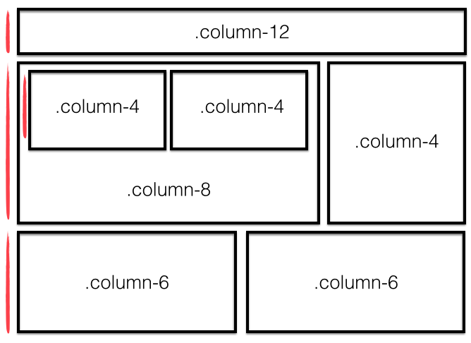

#Bower & Bootstrap

###Learning Objectives

* Use Bower to require Bootstrap in your project
* Understand and impliment a grid system
* Design html pages based on several mockups

##What is Bootstrap?

[Bootstrap]() is a collection of CSS classes and JavaScript functions that enable us build sleek & stylish websites quickly.

##Bower can make our life easier

Bower is a tool that helps us find, download, and manage the numberous javascript & css libraries you frequently use in html your. 

jQuery, Underscore, Bootstrap, etc are all libraries we may want to add to our project. It can be a hassle to go searching around to find the where each one lives when we are linking them to our html page. Instead let's use **Bower**, a library management tool, which will bring them to us!

###Installing Bower

You'll only need to do this once. Install bower with...

```bash
npm install -g bower
```

**Note: as we installed it globally with `-g` we can run `bower` from anywhere in our computer.**

Let's now make and enter into a directory, `/funWithBootstrap`, which we will use to play around with these tools.

Ok, create an `index.html` file we will also be using later. Here's some starter code:

```html
<!DOCTYPE html>
<html>
<head>
  <title>Title</title>
  <meta charset="utf-8" />
  <meta http-equiv="Content-type" content="text/html; charset=utf-8" />
  <meta name="viewport" content="width=device-width, initial-scale=1" />
  <link rel="stylesheet" type="text/css" href="#">
</head>
<body>
  
</body>
</html>
```

###Using Bower

Let's now grab a few example dependencies: jQuery, Underscore, and Bootstrap.

```bash
bower install jquery underscore bootstrap
```

*Note: we can install muliple files at once by seperating their names with spaces, nifty!*

You'll notice you now have a `bower_compents` directory, which inside you'll find a directy for jQuery, Underscore and Bootstrap.

Inside of each of these folders you'll see a bunch of files. Don't worry. The file with the name of the library is probably the main one. For example `/underscore/underscore.js` is the only file you'll use for Underscore. If it not readily apparent you may need to look inside a `dist` (for distribution) directory to find what you're looking for.

####Why so many files?
The core library (e.g. `underscore.js`) is actually getting a lot of it's logic from other files. Additionally there might be assets or even optional components you can include, which aren't core to the library.

####What's this `.min` thing?
`.min` before the file extension, such as `.min.css` or `.min.js` just signals that all the whitespace has been taken out of the file and the variables have been renamed to be as short as possible. This is called **minification** It is a very bad idea to try to read a minified file. Instead those files are only used in production when you want to shortened.

####What's bootstrap-theme

The `bootstrap-theme` file is an option file that will give you bootstrap components additional styles.


###Requiring the Libraries

Now we would like to have our html file link to jQuery, Underscore, and most importantly Bootstrap! *Note: Bootstrap come with both CSS and Javascript libraries that work together.*

###Challenge: Require the libraries

From your html file use `<script>` and `<link>` tags to import jQuery, Underscore, Bootstrap (both the CSS & JavaScript files) into your projects. Let's use the non-minifed versions of the files for now and you can import Bootstrap's option theme file if you wish.

Tip: Chances are you'll spell something in the path wrong, so check your chrome console to see an error message saying it didn't find the file with that path. Fix the path referencing the file, clear your errors (with ctr-L) and refresh the page making sure there are no more new errors.


##Using Bootstrap

[More here](https://github.com/wdi-sf-fall/notes/blob/master/week_01_fundamentals/day_2_productivity_htmlcssbootstrap/dusk_html_css%20and%20bootstrap/readme.md)

###A Grid System

A grid enables you to layout your html content in a structured manner.

The majority of websites use some sort of grid-system. Bootstrap comes with a grid-system built in, but it's easily to create your own.

**How could we create our own?**

All your content will live inside a column which in turn exists inside a row. Columns are typically a fraction of twelve as it's a very divisible number. 

Below, the orange marks represent distinct rows and we are using a grid with twelve columns.



You can see the top row has an element inside of it that takes up all twelve columns, while the bottom row has two elements inside of it that each take up 6 columns.

**How could we build it?** 

Given we want to build a 12-column grid system we would have to consider 12 of 12 columns 100% of the page, 6 of 12 columns 50%, 4 of 12 30%, etc. Here's an example implimentation below.

```css
.column-12 {
    width: 100%;
}

.column-11 {
    width: 91.53;
}

.column-10 {
    width: 83.07%;
}

.column-9 {
    width: 74.6%;
}

.column-8 {
    width: 66.13%;
}

.column-7 {
    width: 57.67%;
}

.column-6 {
    width: 49.2%;
}

.column-5 {
    width: 40.73%;
}

.column-4 {
    width: 32.27%;
}

...
```

###Challenge: Grids

What percentage would you have to make the width for a div that took up 3 columns (.column-3)? How about 2 & 1 (.column-2, .column-1)?

###Responsiveness


##Mockups

We'll be coding up a few mockups using Bootstrap.

###Setup

In the `mockups` directory you can find three images that you will be coding up.

Tip: If you need placeholder images try [placekitten](https://placekitten.com/)

Find 

FIXME
[Here](https://github.com/wdi-sf-fall/bootstrap-lab/tree/master)

###Option 1

###Option 2

###Option 3


##Solutions

###Require the libraries

Once you import jQuery, Underscore, and Bootstrap the resulting html file should look similar to:

```html
<!DOCTYPE html>
<html>
<head>
  <title>Title</title>
  <meta charset="utf-8" />
  <meta http-equiv="Content-type" content="text/html; charset=utf-8" />
  <meta name="viewport" content="width=device-width, initial-scale=1" />
  <!-- underscore -->
  <script type="text/javascript" src="bower_components/underscore/underscore.js"></script>
  <!-- jquery -->
  <script type="text/javascript" src="bower_components/jquery/dist/jquery.js"></script>
  <!-- boostrap js -->
  <script type="text/javascript" src="bower_components/bootstrap/dist/js/bootstrap.js"></script>
  <!-- boostrap css -->
  <link rel="stylesheet" type="text/css" href="bower_components/bootstrap/dist/css/bootstrap.css">
  <!-- boostrap css theme (optional) -->
  <link rel="stylesheet" type="text/css" href="bower_components/bootstrap/dist/css/bootstrap-theme.css">
</head>
<body>
  
</body>
</html>
```

###Grids

```
.column-3 {
    width: 23.8%;
}

.column-2 {
    width: 15.33%;
}

.column-1 {
    width: 6.87%;
}
```

###Mockups

FIXME
[Here](https://github.com/wdi-sf-fall/bootstrap-lab/tree/solution)


